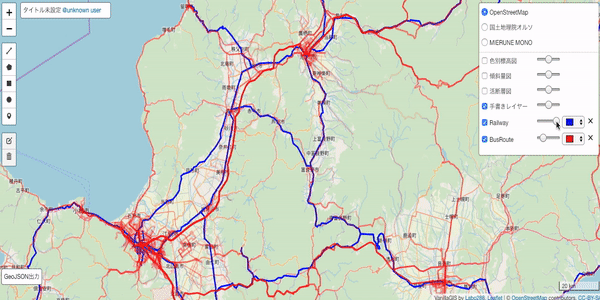

# Leaflet.Control.Appearance
The Leaflet plugin to control Appearances of Layers - color, opacity and able to remove a overlay layer.

# Sample


You can also see at bellow page.

[Vanilla GIS](https://github.com/Kanahiro/vanilla-gis)

[vanilla-gis/GitHub](https://github.com/Kanahiro/vanilla-gis)

# Usage
## Declaration
- import Leaflet.Control.Appearance.js, then declare and add to leaflet map.

```JavaScript
	var appearanceControl = L.control.appearance(baseLayers, uneditableOverlays, overlays, {opacity:true,
			                                                                        remove:true,
			                                                                        color:true,
			                                                                        removeIcon:"./static/js/leaflet/img/remove_icon.png"});
	appearanceControl.addTo(map);
```

## Arguments
This needs three layers args, different type layer.
- baseLayers is array of BASEMAP and they cannot be changed or removed.
- uneditableOverlays is array of OVERLAY you don't want change their appearance.
- overlays is array of OVERLAY, each OVERLAY can be changed appearance and removed.

## Options
Leaflet.Control.Appearance has some options. You can choose elements can be controlled.
- position: default:'topright'
- radioCheckbox: default:true
- layerName: default:true
- opacity: default:false
- color: default:false
- remove: default:false
- removeIcon: default:null, //String, a URL for image of removeIcon

## Add Props on JavaScript
This plugin needs that layers have options for interactive control.
- layer.options.name
- layer.options.color
- layer.options.opacity

Each must have default value to show default appearance appropriately.

Leaflet.Control.Appearance refer and change layers options value.

# Contact
kanahiro.iguchi@gmail.com